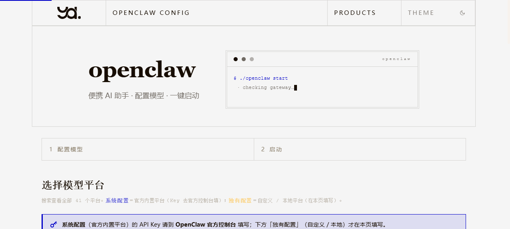
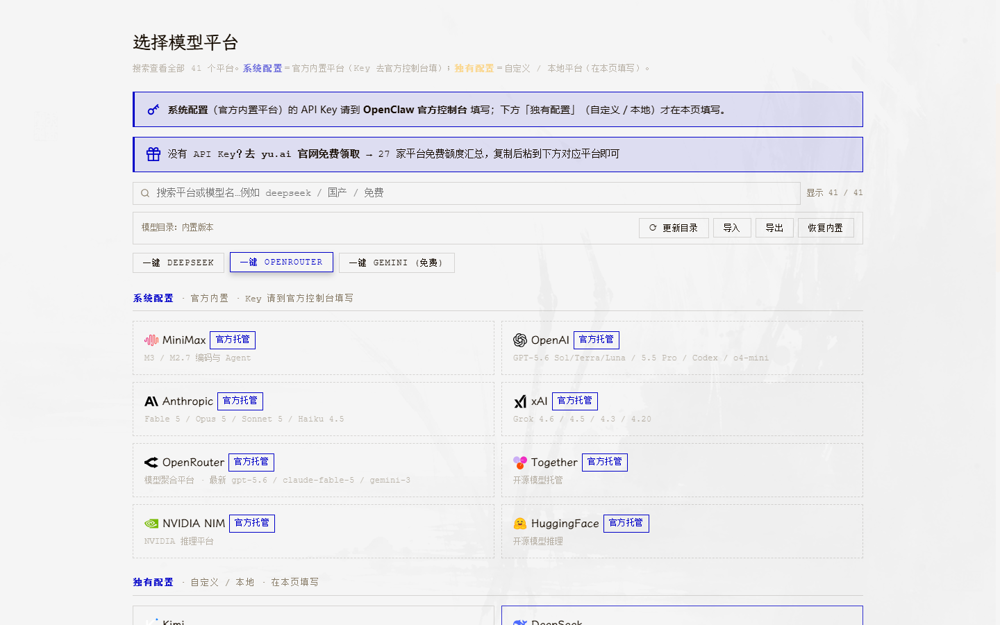
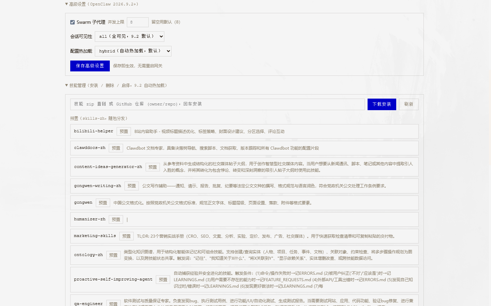
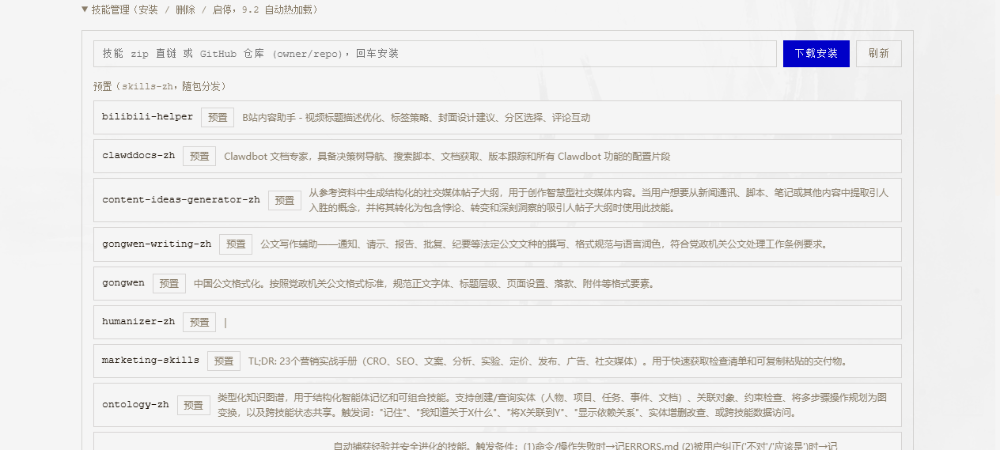

# OpenClaw Portable

**English** | [简体中文](README.zh-CN.md)

Pack [OpenClaw](https://github.com/openclaw/openclaw) — the open-source AI assistant / gateway — into a fully self-contained portable edition. Plug a USB drive into any computer and run with zero installation and zero host pollution.



## Features

- **Zero install** — bundled Node.js runtime, double-click to start
- **Cross-platform** — Windows x64, macOS (Apple Silicon / Intel), Linux (x64 / ARM64)
- **Visual Config Center** — pick a model platform, paste your API key, save, open chat. Two steps, no CLI
- **32 model platforms** — 15 Chinese + 8 international + 5 aggregators + 1 accelerator + 1 custom relay + 2 local (Ollama / LM Studio auto-detected)
- **12 chat channels** — Telegram / QQ / Feishu / WeCom / Discord / Slack / WhatsApp / Signal / LINE / Google Chat / MS Teams / WeChat
- **Skill manager** — install skills from a zip URL or GitHub repo, enable/disable/delete right in the Config Center; OpenClaw 2026.9.2+ hot-reloads them automatically
- **Advanced settings** — Swarm sub-agent concurrency, session visibility, config hot-reload mode — saved live without restarting the gateway
- **Mobile Connect** — phones on the same WiFi use the gateway via browser (zero install), the official app, or third-party apps
- **Auto update** — one-click update from GitHub Releases with backup and rollback
- **Data stays local** — API keys and chat history live only on the USB drive, never uploaded
- **Chinese skill pack** — built-in search, translate, weather, and Xiaohongshu / Zhihu / Weibo / Bilibili writing assistants

## Screenshots

| Model platforms (41 built-in) | Skills manager & advanced settings |
|---|---|
|  |  |

## Quick Start

### Use a Release Package (Recommended)

Download the zip from [Releases](https://github.com/yuluyangguang1/openclaw-portable/releases), extract to a USB drive or any directory.

| Platform | How to Launch |
|----------|---------------|
| Windows | Double-click `OpenClaw.vbs` |
| macOS | Double-click `OpenClaw.app` |
| Linux | Double-click `OpenClaw.desktop` |

A browser opens the Config Center automatically. Pick a model platform → paste API key → save → open chat.

All data travels with the USB drive — nothing pollutes the host machine.

> **Upgrading**: download the new zip and extract over the old folder — your `data/` directory (keys, history, installed skills) is preserved by the updater.

### macOS First Launch

macOS may show "cannot verify developer". Fix (pick one):

1. Right-click `OpenClaw.app` → choose "Open" → click "Open" in the dialog
2. Run in Terminal: `xattr -cr /path/to/OpenClawPortable`
3. System Settings → Privacy & Security → click "Open Anyway" at the bottom

### Build from Source

```bash
git clone https://github.com/yuluyangguang1/openclaw-portable.git
cd openclaw-portable
bash setup.sh                 # current platform
bash setup.sh --all-platforms # all platforms, for a USB drive
```

Windows: use `setup.bat` or `setup.ps1`.

## Config Center

Opens at `http://127.0.0.1:18750` after launch.

**Step 1 — Configure a model**
- Click a platform card to expand it
- Pick a concrete model
- Paste your API key
- Local runtimes: LM Studio (port 1234) / Ollama (port 11434) are auto-detected

**Step 2 — Launch**
- Click "Open Chat" to enter the gateway web UI

Other features: update (with rollback), `openclaw doctor` diagnostics, gateway restart, config export/import/reset, 12-channel onboarding, Mobile Connect toggle, live gateway logs.

### Model Catalog Hot Update

The platform/model list doesn't wait for full package upgrades — users can pull the latest catalog on demand:

- **User side**: the "pick a platform" page has a catalog toolbar (`Update / Import / Export / Restore built-in`). "Update" pulls the latest list from this repo; caches older than 7 days refresh automatically in the background. Offline users can download `models-catalog.json` on another device and click "Import".
- **Cache location**: `data/.openclaw/models-catalog.json` — the `data/` directory survives package upgrades.
- **Maintainer side**: edit [`system/models-catalog.json`](system/models-catalog.json) (use a date for `version`, e.g. `2026.08.22`) and push — users can pull it right away. Fetch order: jsDelivr → raw.githubusercontent → ghproxy mirror, all reachable from mainland China.
- **Custom sources**: power users can put a URL array in `data/.openclaw/catalog-sources.json` to override the defaults.
- Saved model configs are untouched by catalog updates — the catalog only affects dropdown options.

### Skill Manager



Three skill sources, all managed from the Config Center:

| Source | Location | Behavior |
|--------|----------|----------|
| Bundled (shipped) | `system/skills-zh/` | Read-only, loaded at startup |
| Optional library | `system/skills-zh-optional/` | One-click enable → copied into managed area |
| Managed (installed) | `data/.openclaw/skills/` | Install / disable / delete; survives upgrades |

- **Install**: paste a zip direct link or a GitHub `owner/repo` and press Enter — the server downloads, unpacks, validates `SKILL.md`, and atomically installs (50 MB / 20 skills per batch caps).
- **Hot reload**: OpenClaw 2026.9.2+ watches these directories — installs, enables, and deletes take effect immediately, no gateway restart.

### Advanced Settings

OpenClaw 2026.9.2+ specific knobs, saved live (no gateway restart):

- **Swarm sub-agents** — enabled / max concurrency (default 8)
- **Session visibility** — `all` (9.2 default) / `agent` / `self`
- **Config hot-reload** — `hybrid` (default) / `off`

## Mobile Connect

Let phones on the same WiFi reach the OpenClaw gateway without installing anything.

| Platform | Launcher |
|----------|----------|
| macOS | `system/Mac-Mobile.command` |
| Linux | `system/Linux-Mobile.sh` |
| Windows | `system/Windows-Mobile.bat` |

Double-click to start the gateway in temporary LAN mode; the original config is restored on exit.

- **Phone browser**: open `http://<PC-LAN-IP>:<port>` — Android and iOS both work
- **Official app**: build `apps/android` / `apps/ios` from the openclaw repo
- **Third-party apps**: andClaw / AnyClaw / FlutterClaw etc., enter the WebSocket address and token manually

You can also toggle Mobile Connect mode directly in the Config Center web UI.

Security: only private network ranges auto-approve pairing; public IPs never pair automatically. Temporary config is deleted on exit.

## Directory Layout

After extracting a release package (user view):

```
OpenClawPortable/
 OpenClaw.vbs                    Windows launcher
 OpenClaw.app                    macOS launcher
 OpenClawPortable使用说明.html    User manual (Chinese)
 data/                           User data (API keys, history, installed skills)
 app/                            Node.js runtime + OpenClaw core
 config-server/                  Config Center web UI + API
 system/                         Scripts + config + skill packs:
  ├─ OPENCLAW_VERSION            Upstream version
  ├─ PORTABLE_VERSION            Portable version
  ├─ default-config.json         Default config
  ├─ models-catalog.json         Model catalog (maintainer single source)
  ├─ skills-zh-manifest.json     Chinese skill manifest
  ├─ verify-skills-zh.py         Manifest verification script
  ├─ skills-zh/                  Chinese skill pack (built-in)
  ├─ skills-zh-optional/         Chinese skill pack (optional)
  ├─ OpenClaw.desktop            Linux launcher
  ├─ README.md                   Offline docs
  ├─ Mac-Start/Menu/Mobile/Diagnose.command
  ├─ Linux-Start/Menu/Mobile/Diagnose.sh
  ├─ Windows-Start/Menu/Mobile/Diagnose.bat
  └─ lib/                        preflight / maintain / mobile helper libs
```

The source repo mirrors this layout: everything except the double-click entrypoints and `app/` / `config-server/` / `data/` lives in `system/` (CI moves launchers from the repo root into `system/` at package time).

## Built-in Skills

| Skill | Description |
|-------|-------------|
| china-search | Chinese search engines |
| china-translate | Chinese–English translation |
| china-weather | Weather lookup |
| xiaohongshu-writer | Xiaohongshu copywriting |
| zhihu-writer | Zhihu answers |
| weibo-poster | Weibo posts |
| wechat-article | WeChat official-account articles |
| bilibili-helper | Bilibili content |
| douyin-script | Douyin scripts |
| deepseek-helper | DeepSeek enhancements |

Skills live in `system/skills-zh/` and load at startup. More are in `system/skills-zh-optional/` — enable them from the Config Center's skill manager.

## Platform Support

| Platform | Architecture | Status |
|----------|--------------|--------|
| Windows | x64 | Supported |
| macOS | Apple Silicon (M1–M4) | Supported |
| macOS | Intel x64 | Supported |
| Linux | x64 | Supported |
| Linux | ARM64 | Supported |
| Android / iOS | via Mobile Connect | Supported |

macOS note: Node.js 24 officially requires macOS 13.5 (Ventura); macOS 12+ works in practice. If launch fails, upgrade macOS.

## For Maintainers

- **Bumping the upstream kernel**: prefer `maintain.sh` → upgrade — it re-runs `lib/promote-official-providers.mjs` automatically after `npm install openclaw@latest` (a fresh install wipes the promoted official provider plugins; promote is idempotent). If you upgrade manually, re-run `node lib/promote-official-providers.mjs <core-dir>` afterwards.
- **Releases**: push a tag like `v2.0.0-beta.6`; CI (Build & Release) builds all platforms and attaches the zip to a GitHub Release automatically. Pre-release flags (`alpha`/`beta`/`rc`) in the tag mark it as a prerelease.
- **Windows launchers are GBK-encoded**: all `.bat` files with Chinese text must stay **GBK + CRLF, no BOM** (cmd.exe on Chinese Windows misparses UTF-8). CI enforces this at package time — don't "fix" the encoding back to UTF-8.

## Upstream Project

Built on [OpenClaw](https://github.com/openclaw/openclaw) — an open-source AI assistant framework with multi-model, multi-channel, and plugin support.

The Portable edition adds:
- Bundled Node.js runtime for zero install
- A visual Config Center replacing CLI configuration
- Bundled Chinese-optimized skill packs
- USB-drive ergonomics (relative paths, data isolation, exFAT compatibility)

## License

MIT
